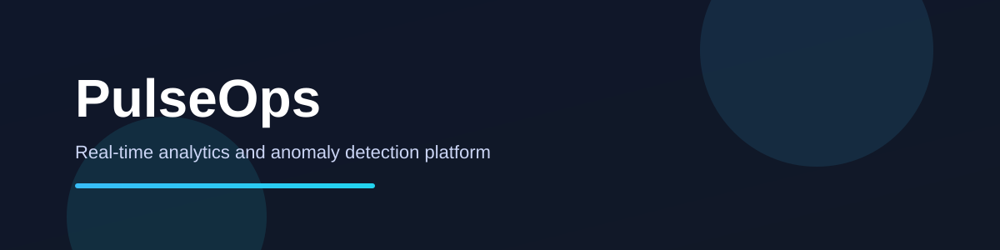
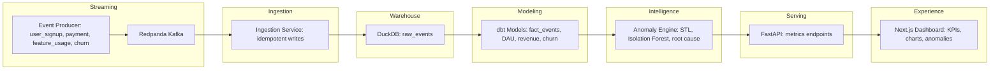
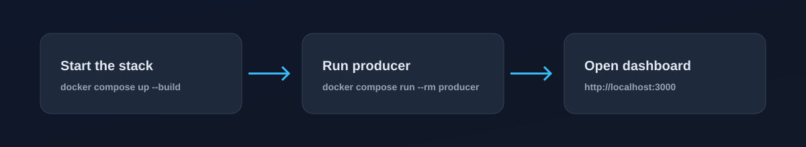

# PulseOps

PulseOps is a real-time analytics and anomaly detection platform for product and revenue teams. It streams events, models KPIs, detects anomalies with root-cause hints, and serves an executive dashboard.

## Highlights

- Real-time ingestion pipeline with Kafka-compatible Redpanda
- DuckDB analytics warehouse with dbt models and tests
- STL + Isolation Forest anomaly detection with explanations
- FastAPI KPI and anomaly endpoints
- Next.js 14 executive dashboard with charts and anomaly feed
- Dockerized stack for one-command local startup

## Architecture

## Local setup

1. Copy environment variables:
   - `cp .env.example .env`
2. Start the stack:
   - `docker compose -f infra/docker-compose.yml up --build`
3. Generate events (from another terminal):
   - `docker compose -f infra/docker-compose.yml run --rm producer`
4. Open the dashboard:
   - `http://localhost:3000`

Optional: run dbt locally:
- `cp analytics/dbt/profiles.yml.example ~/.dbt/profiles.yml`
- `dbt run --project-dir analytics/dbt`

## System requirements

- Docker Desktop (recommended: 4+ GB memory, 2+ CPU cores)
- Ports: 3000 (web), 8000 (api), 9092 (redpanda)
- Local development: Node 20, Python 3.11
- Optional: dbt-core + dbt-duckdb for local runs

## KPI API

- `GET /metrics/dau`
- `GET /metrics/revenue`
- `GET /metrics/churn`
- `GET /metrics/anomalies`

## Services

- `redpanda`: Kafka-compatible streaming broker
- `producer`: event generator (on-demand)
- `ingestion`: Kafka consumer writing to DuckDB
- `dbt`: incremental KPI modeling
- `api`: FastAPI metrics and anomalies
- `web`: Next.js dashboard

## Tech stack

- Frontend: Next.js 14, TypeScript, TailwindCSS, Recharts
- Backend: FastAPI, Pydantic, DuckDB
- Streaming: Redpanda (Kafka)
- Modeling: dbt-core
- ML: scikit-learn, statsmodels
- Infra: Docker & docker-compose

## Screenshots

- Executive KPI overview
- Anomaly feed with explanations
- Revenue and churn trends
- Demo preview: `docs/assets/demo.gif`

## Repository layout

- `apps/api`: FastAPI backend + ingestion worker
- `apps/web`: Next.js dashboard
- `analytics/dbt`: dbt models and tests
- `analytics/warehouse`: DuckDB files
- `streaming/producer`: Kafka event generator
- `ml/anomaly_engine`: detection + explanation logic
- `infra/docker-compose.yml`: local stack
- `docs`: architecture and KPI definitions

## Documentation

- `docs/architecture.md`: design decisions and data flow
- `docs/metrics.md`: business KPI definitions
- `docs/demo.md`: demo guide

